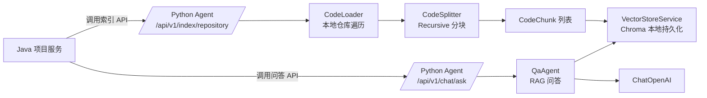
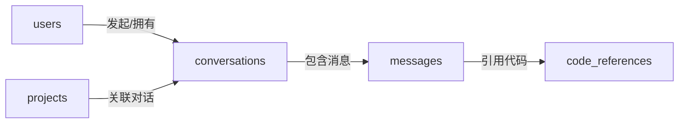

# 项目维基 (Project Wiki)

## 📋 目录

- [项目概述](#项目概述)
- [架构设计](#架构设计)
- [技术栈详解](#技术栈详解)
- [模块说明](#模块说明)
- [测试](#测试)
- [开发指南](#开发指南)
- [API接口文档](#api接口文档)
- [数据库设计](#数据库设计)
- [部署指南](#部署指南)
- [技术难点与解决方案](#技术难点与解决方案)
- [常见问题](#常见问题)

---

## 项目概述

### 项目名称
智能代码助手平台 (Code Assistant Platform)

### 项目定位
基于微服务架构的智能代码辅助工具，结合传统后端技术(Java)和AI技术(Python)，为开发者提供智能问答、代码审查、文档生成等功能。

### 核心价值
- 🎯 **技术全面性**: 同时展示Java后端和Python Agent开发能力
- 🏗️ **架构合理性**: 微服务架构，业务逻辑与AI推理分离
- 💼 **求职导向**: 专为Agent应用开发岗位设计的项目

### 项目目标
- 3-4个月完成MVP版本
- 包含完整的用户系统、项目管理、Agent服务
- 支持Docker一键部署
- 代码质量达到生产级别

> 版本一致性说明：当前实现采用 Spring Boot 2.7.18 + Java 17；OpenAPI 使用 Springdoc 1.7.x；Spring Security 采用 Boot 2.7 风格配置（EnableGlobalMethodSecurity + antMatchers）。

---

## 架构设计

### 1. 整体架构

```
┌─────────────────────────────────────────────────────────┐
│                     前端层                               │
│        React 18 + TypeScript + Tailwind CSS             │
│              Neo-Brutalism 设计风格                      │
└─────────────────────────────────────────────────────────┘
                            ↓
┌─────────────────────────────────────────────────────────┐
│                   Nginx 反向代理                         │
│              - 请求路由                                  │
│              - 负载均衡                                  │
│              - 静态资源服务                              │
└─────────────────────────────────────────────────────────┘
                            ↓
        ┌───────────────────┴───────────────────┐
        ↓                                       ↓
┌─────────────────────┐              ┌─────────────────────┐
│   Java 业务服务层    │              │  Python Agent层     │
│   (Spring Boot)     │   HTTP REST  │    (FastAPI)        │
│                     │ ←──────────→ │                     │
│ ┌─────────────────┐ │              │ ┌─────────────────┐ │
│ │  用户服务        │ │              │ │ 代码问答Agent   │ │
│ │  - 注册/登录     │ │              │ │ - RAG检索       │ │
│ │  - JWT认证      │ │              │ │ - 对话管理      │ │
│ │  - 权限管理     │ │              │ └─────────────────┘ │
│ └─────────────────┘ │              │                     │
│                     │              │ ┌─────────────────┐ │
│ ┌─────────────────┐ │              │ │ 代码审查Agent   │ │
│ │  项目服务        │ │              │ │ - 静态分析      │ │
│ │  - 项目CRUD     │ │              │ │ - LLM深度审查   │ │
│ │  - 代码仓库管理 │ │              │ │ - 报告生成      │ │
│ │  - 任务调度     │ │              │ └─────────────────┘ │
│ └─────────────────┘ │              │                     │
│                     │              │ ┌─────────────────┐ │
│ ┌─────────────────┐ │              │ │ 文档生成Agent   │ │
│ │  网关服务        │ │              │ │ - 代码解析      │ │
│ │  - 请求路由     │ │              │ │ - 文档模板      │ │
│ │  - 限流熔断     │ │              │ │ - Markdown生成  │ │
│ └─────────────────┘ │              │ └─────────────────┘ │
└─────────────────────┘              └─────────────────────┘
        ↓                                       ↓
┌─────────────────────────────────────────────────────────┐
│                      数据存储层                          │
│  ┌──────────────┐  ┌──────────────┐  ┌──────────────┐  │
│  │ PostgreSQL   │  │    Redis     │  │  ChromaDB    │  │
│  │ - 用户数据   │  │  - 缓存      │  │ - 向量存储   │  │
│  │ - 项目数据   │  │  - Session   │  │ - 代码索引   │  │
│  │ - 任务记录   │  │  - 消息队列  │  │              │  │
│  └──────────────┘  └──────────────┘  └──────────────┘  │
└─────────────────────────────────────────────────────────┘
```

### 2. 服务职责划分

#### Java服务层
**职责**: 处理业务逻辑、数据持久化、用户认证

| 服务名称 | 端口 | 职责 |
|---------|------|------|
| user-service | 8080 | 用户注册、登录、JWT认证、权限管理 |
| project-service | 8081 | 项目管理、仓库接入、任务调度 |
| gateway-service (可选) | 8888 | API网关、统一鉴权、限流 |

**技术栈**:
- Spring Boot 3.2
- Spring Security
- MyBatis-Plus
- JWT
- Redis

#### Python Agent层
**职责**: AI推理、代码分析、向量检索

| 模块名称 | 职责 |
|---------|------|
| QA Agent | 基于RAG的代码问答 |
| Review Agent | 代码质量审查 |
| Doc Agent | 自动文档生成 |
| Index Service | 代码向量化和索引 |

**技术栈**:
- FastAPI
- LangChain
- LlamaIndex
- ChromaDB
- Celery

### 3. 服务间通信

#### 通信方式
```
Java → Python: HTTP REST API
Python → Java: HTTP REST API (回调)
异步任务: Redis消息队列
```

#### 通信流程示例
```
用户请求代码审查:
1. 前端 → Nginx → Java project-service
2. Java创建审查任务,返回task_id
3. Java异步调用 Python review-agent API
4. Python执行审查,结果存入Redis
5. Java轮询或WebSocket推送结果给前端
```

---

## 技术栈详解

### 前端技术栈

#### React 18 + TypeScript
- **选择理由**: 生态最成熟，求职市场需求最大
- **核心特性**:
  - 函数式组件 + Hooks
  - 类型安全
  - 并发渲染特性

#### Tailwind CSS
- **选择理由**: 原子化 CSS，快速开发，易于实现 Neo-Brutalism 风格
- **核心特性**:
  - 无需写自定义 CSS
  - 直接在 JSX 中使用样式类
  - 构建时自动剔除未使用样式

#### Vite
- **选择理由**: 极速开发服务器，热更新快
- **核心特性**:
  - 原生 ES Module
  - 快速冷启动
  - 优化的构建产物

#### Neo-Brutalism 设计风格
- **风格特征**:
  - 黑色实线边框（1-3px）
  - 无模糊、位移型硬阴影（3/6/10px）
  - 黑白为底 + 1-2 个点缀纯色
  - 直角或极小圆角（2px）
  - 高对比度，拒绝柔和
- **详细规范**: 参见 `docs/FRONTEND_DESIGN_SPEC.md`

#### Zustand
- **选择理由**: 轻量级状态管理，比 Redux 简单
- **核心特性**:
  - 无样板代码
  - TypeScript 友好
  - 学习曲线平缓

### Java技术栈

#### Spring Boot 3.2
- **选择理由**: 最新稳定版,性能优化,原生支持GraalVM
- **核心特性**:
  - 自动配置
  - 嵌入式服务器
  - 生产级监控(Actuator)

#### Spring Security + JWT
- **认证流程**:
  ```
  1. 用户登录 → 验证用户名密码
  2. 生成JWT Token (Access + Refresh)
  3. 前端携带Token访问API
  4. JwtAuthenticationFilter验证Token
  5. 提取用户信息,注入SecurityContext
  ```

#### MyBatis-Plus
- **选择理由**: 比JPA更灵活,比MyBatis更简洁
- **核心功能**:
  - 单表CRUD无需写SQL
  - 分页插件
  - 逻辑删除
  - 乐观锁

#### Redis
- **用途**:
  1. 缓存热点数据 (用户信息、项目配置)
  2. Session存储
  3. 分布式锁
  4. 消息队列(可选)

### Python技术栈

#### FastAPI
- **选择理由**:
  - 性能接近Go/Node.js
  - 自动生成OpenAPI文档
  - 原生异步支持
  - 类型提示友好

#### LangChain
- **核心组件**:
  ```python
  - LLM: 大模型接口封装
  - Prompt Templates: 提示词模板
  - Chains: 工作流编排
  - Agents: 自主决策和工具调用
  - Memory: 对话历史管理
  - Retrievers: 向量检索
  ```

#### ChromaDB
- **选择理由**:
  - 轻量级,无需独立服务
  - Python原生支持
  - 适合MVP阶段
- **可替换方案**: Pinecone, Milvus, Weaviate

#### Celery
- **用途**: 异步任务处理
  - 代码索引任务
  - 批量审查任务
  - 定时任务

---

## 模块说明

### Java模块

#### 1. user-service (用户服务)

**目录结构**:
```
user-service/
├── controller/          # API控制器
│   ├── AuthController.java       # 认证接口
│   └── UserController.java       # 用户管理接口
├── service/            # 业务逻辑
│   ├── AuthService.java
│   ├── UserService.java
│   └── impl/
├── mapper/             # 数据访问
│   └── UserMapper.java
├── entity/             # 实体类
│   └── User.java
├── dto/                # 数据传输对象
│   ├── LoginRequest.java
│   ├── RegisterRequest.java
│   └── UserResponse.java
├── security/           # 安全相关
│   ├── JwtAuthenticationFilter.java
│   ├── JwtTokenProvider.java
│   └── SecurityConfig.java
└── config/             # 配置类
    ├── RedisConfig.java
    └── SwaggerConfig.java
```

**核心功能**:
- ✅ 用户注册 (密码加密)
- ✅ 用户登录 (JWT生成)
- ✅ Token刷新
- ✅ 用户信息CRUD
- ✅ 权限验证

#### 2. project-service (项目服务)

**目录结构**:
```
project-service/
├── controller/
│   ├── ProjectController.java
│   └── RepositoryController.java
├── service/
│   ├── ProjectService.java
│   ├── RepositoryService.java
│   └── AgentClientService.java  # 调用Python服务
├── entity/
│   ├── Project.java
│   └── Repository.java
└── dto/
    ├── ProjectCreateRequest.java
    └── CodeReviewRequest.java
```

**核心功能**:
- ✅ 项目CRUD
- ✅ GitHub仓库接入
- ✅ 调用Python Agent服务
- ✅ 任务状态管理

### Python模块

#### agent-service

**目录结构**:
```
agent-service/
├── app/
│   ├── main.py                 # FastAPI入口
│   ├── api/v1/
│   │   ├── chat.py            # 问答接口
│   │   ├── review.py          # 审查接口
│   │   └── index.py           # 索引接口
│   ├── agents/
│   │   ├── base_agent.py      # Agent基类
│   │   ├── qa_agent.py        # 问答Agent
│   │   ├── review_agent.py    # 审查Agent
│   │   └── doc_agent.py       # 文档Agent
│   ├── services/
│   │   ├── code_indexer.py    # 代码索引
│   │   ├── vectorstore.py     # 向量存储
│   │   └── llm_service.py     # LLM调用
│   ├── models/
│   │   ├── chat.py            # 对话模型
│   │   └── review.py          # 审查模型
│   └── core/
│       ├── config.py          # 配置
│       └── dependencies.py    # 依赖注入
└── tests/
```

**核心功能**:
- ✅ 代码问答 (RAG)
- ✅ 代码审查 (静态+LLM)
- ✅ 文档生成
- ✅ 代码向量化索引

---

## 测试

### Agent Service 测试

#### 测试概览

Agent Service 拥有完整的测试套件，测试覆盖率达到 **99.0%**（103/104 测试通过）。

**测试统计**:
- **集成测试**: 31 个
- **单元测试**: 73 个
- **总耗时**: 约 37 秒
- **跳过**: 1 个（符号链接测试，环境限制）

#### 测试架构

```
agent-service/tests/
├── integration/              # 集成测试（API 端到端）
│   ├── test_chat_api.py     # Chat API 测试（16 个测试）
│   │   ├── TestChatAskAPI                # 基础问答功能
│   │   ├── TestChatCompatAPI             # 兼容性接口
│   │   ├── TestChatAPIEndToEnd           # 端到端流程
│   │   ├── TestChatAPIResponseFormat     # 响应格式验证
│   │   └── TestChatAPISourcesMetadata    # 代码引用元数据
│   └── test_index_api.py    # Index API 测试（15 个测试）
│       ├── TestIndexRepositoryAPI        # 仓库索引功能
│       ├── TestIndexStatusAPI            # 状态查询
│       ├── TestIndexStatsAPI             # 统计信息
│       ├── TestIndexAPIEndToEnd          # 端到端流程
│       ├── TestIndexAPIWithMockedOpenAI  # Mock OpenAI 测试
│       └── TestIndexAPIResponseFormat    # 响应格式验证
│
└── unit/                     # 单元测试（组件级）
    ├── test_code_loader.py  # CodeLoader 测试（22 个测试）
    │   ├── TestDetectLanguage            # 语言检测（7 个）
    │   └── TestCodeLoader                # 代码加载（15 个）
    ├── test_code_splitter.py # CodeSplitter 测试（13 个测试）
    │   └── TestCodeSplitter              # 分块算法和元数据
    ├── test_embedding_service.py # EmbeddingService 测试（17 个测试）
    │   └── TestEmbeddingService          # 向量生成和重试机制
    └── test_vectorstore.py  # VectorStoreService 测试（21 个测试）
        ├── TestChromaClientManagement    # Chroma 客户端管理
        └── TestVectorStoreService        # 向量存储操作
```

#### 运行测试

**前置准备**:
```bash
cd agent-service

# 激活虚拟环境
source venv/bin/activate  # Linux/Mac
venv\Scripts\activate     # Windows

# 安装测试依赖（requirements.txt 已包含）
pip install pytest pytest-asyncio pytest-cov httpx
```

**运行全部测试**:
```bash
# 运行所有测试（详细模式）
pytest tests/ -v

# 运行测试并生成覆盖率报告
pytest tests/ --cov=app --cov-report=html

# 运行测试并显示详细输出
pytest tests/ -v -s
```

**运行特定测试**:
```bash
# 只运行集成测试
pytest tests/integration/ -v

# 只运行单元测试
pytest tests/unit/ -v

# 运行特定文件
pytest tests/unit/test_code_loader.py -v

# 运行特定测试类
pytest tests/unit/test_code_loader.py::TestCodeLoader -v

# 运行特定测试方法
pytest tests/unit/test_code_loader.py::TestCodeLoader::test_load_sample_repository -v
```

**运行测试并过滤警告**:
```bash
# 隐藏弃用警告
pytest tests/ -v -W ignore::DeprecationWarning

# 只显示错误，不显示警告
pytest tests/ -v --disable-warnings
```

#### 测试覆盖范围

##### 集成测试

**Chat API 测试（16 个）**:
- ✅ 基础问答功能（成功场景、索引未就绪、无效请求）
- ✅ 请求参数验证（缺失字段、无效 JSON、类型错误）
- ✅ 中文支持验证
- ✅ 会话 ID 关联
- ✅ 兼容性接口（snake_case / camelCase 参数）
- ✅ 响应格式标准化验证
- ✅ 代码引用元数据（文件路径、行号）
- ✅ 端到端工作流（索引 → 多次问答）

**Index API 测试（15 个）**:
- ✅ 本地仓库索引（成功场景）
- ✅ 错误处理（不存在的仓库、无效 JSON、缺失字段）
- ✅ 重复索引覆盖验证
- ✅ 状态查询（已索引、未找到、无效项目 ID）
- ✅ 统计信息查询（文档数量、集合状态）
- ✅ 多项目隔离验证
- ✅ Mock OpenAI API 测试（避免真实调用）
- ✅ 响应格式标准化验证

##### 单元测试

**CodeLoader 测试（22 个）**:
- ✅ 多语言检测（Java/Python/TypeScript/JavaScript/Markdown/未知扩展名/大小写不敏感）
- ✅ 仓库加载（示例仓库、支持的扩展名、忽略的目录）
- ✅ 文件大小限制（超大文件跳过）
- ✅ 相对路径计算
- ✅ 错误处理（不存在路径、文件路径作为仓库）
- ✅ 编码处理（UTF-8、混合换行符）
- ✅ 多项目隔离（不同项目 ID）
- ✅ 语言检测集成
- ✅ 空仓库处理
- ✅ 符号链接处理（跳过，环境限制）
- ✅ 常量验证（支持的扩展名、忽略的目录）

**CodeSplitter 测试（13 个）**:
- ✅ 基础分块功能
- ✅ 元数据一致性（chunk_id、file、language、project_id）
- ✅ 行号顺序验证
- ✅ 近似行号计算
- ✅ 参数影响（chunk_size、chunk_overlap）
- ✅ 边界条件（空文件、单行文件）
- ✅ Chunk ID 唯一性
- ✅ 文档转换（CodeChunk → LangChain Document）
- ✅ 大文件分块
- ✅ 多语言支持
- ✅ 内容完整性（分块内容是原始内容的子串）

**EmbeddingService 测试（17 个）**:
- ✅ 初始化（成功、失败场景）
- ✅ 文档向量化（成功、空列表、单文档）
- ✅ 查询向量化（成功、中文文本、多行文本）
- ✅ 重试机制（失败重试、超过最大重试次数）
- ✅ 批量处理（大批量文档）
- ✅ 特殊字符处理
- ✅ 配置验证（模型名称、自定义 API Base）
- ✅ 并发调用测试
- ✅ 底层对象访问（embedding 属性）

**VectorStoreService 测试（21 个）**:
- ✅ Chroma 客户端管理（初始化、幂等性、清理）
- ✅ 集合名称生成（包含配置前缀）
- ✅ 集合重置（创建新集合、删除旧数据）
- ✅ 文档批量插入（成功、空列表）
- ✅ 检索器获取（默认参数、自定义 k 值）
- ✅ 集合统计信息（存在、不存在）
- ✅ 多项目隔离验证
- ✅ 大批量文档处理
- ✅ 元数据保留验证
- ✅ 增量插入测试
- ✅ 语义搜索验证
- ✅ 重复内容处理

#### 测试配置

**pytest.ini**:
```ini
[pytest]
asyncio_mode = auto
asyncio_default_fixture_loop_scope = function
testpaths = tests
python_files = test_*.py
python_classes = Test*
python_functions = test_*
```

**关键配置说明**:
- `asyncio_mode = auto`: 自动检测异步测试
- `testpaths = tests`: 测试文件搜索路径
- 命名约定：测试文件 `test_*.py`，测试类 `Test*`，测试函数 `test_*`

#### Mock 策略

为了避免真实 API 调用（降低成本和不稳定性），测试中使用了以下 Mock 策略：

**OpenAI API Mock**:
```python
# 集成测试中 Mock OpenAI Embeddings
@patch("langchain_openai.embeddings.OpenAIEmbeddings.embed_documents")
@patch("langchain_openai.embeddings.OpenAIEmbeddings.embed_query")
def test_index_with_mocked_embeddings(mock_embed_query, mock_embed_documents):
    # 返回固定长度的假向量
    mock_embed_documents.return_value = [[0.1] * 1536]
    mock_embed_query.return_value = [0.1] * 1536
    # ... 测试逻辑
```

**测试数据隔离**:
```python
# 使用临时目录作为测试仓库
@pytest.fixture
def temp_repo(tmp_path):
    repo_path = tmp_path / "test_repo"
    repo_path.mkdir()
    # 创建测试文件
    (repo_path / "test.py").write_text("print('hello')")
    return str(repo_path)
```

#### 常见测试问题

**Q1: 测试运行时提示 OpenAI API Key 未配置？**
```
解决方案：
1. 检查 .env 文件是否存在 OPENAI_API_KEY
2. 集成测试应该 Mock API 调用，检查 Mock 是否生效
3. 运行前确保环境变量已加载：source .env
```

**Q2: Chroma 相关测试失败？**
```
解决方案：
1. 检查 chroma_data/ 目录是否有写权限
2. 运行前清理旧数据：rm -rf agent-service/chroma_data/test_*
3. 确保没有其他进程占用 Chroma 数据库
```

**Q3: 测试覆盖率报告在哪里？**
```
运行：pytest tests/ --cov=app --cov-report=html
查看：在浏览器中打开 htmlcov/index.html
```

**Q4: 如何调试单个测试？**
```bash
# 使用 -s 显示 print 输出，-v 显示详细信息
pytest tests/unit/test_code_loader.py::TestCodeLoader::test_load_sample_repository -v -s

# 使用 --pdb 在失败时进入调试器
pytest tests/unit/test_code_loader.py -v --pdb
```

**Q5: 警告信息太多，如何过滤？**
```bash
# 隐藏所有警告
pytest tests/ -v --disable-warnings

# 只隐藏特定类型的警告
pytest tests/ -v -W ignore::DeprecationWarning
pytest tests/ -v -W ignore::PydanticDeprecatedSince20
```

#### 持续改进计划

- [x] Agent Service 后端对齐 Pydantic V2 配置风格（使用 ConfigDict / model_config），减少 Pydantic 相关弃用警告。
- [x] QA Agent 检索逻辑切换为 `retriever.invoke` 接口，对齐 langchain-core 0.1.46 之后的推荐用法。
- [x] 集成测试使用 `httpx.ASGITransport(app=...)` 替代 `AsyncClient(app=...)` 快捷方式，消除 HTTPX 的 `app shortcut` 弃用警告。
- [x] 集成到 CI/CD 流程（GitHub Actions），新增 `.github/workflows/test.yml` 自动运行 Agent Service 测试与覆盖率门槛检查。
- [x] 设置 Agent Service 覆盖率门槛（pytest.ini `--cov-fail-under=80`），确保测试质量下限。
- [ ] 添加性能基准测试（索引速度、查询延迟）
- [ ] 添加压力测试（并发索引、高频查询）
- [ ] 生成测试报告（HTML/XML 格式）

---

## 开发指南

### 环境准备

#### 必需软件
```bash
# Java环境
JDK 17+
Maven 3.8+

# Python环境
Python 3.10+
pip

# 数据库和缓存
PostgreSQL 14+
Redis 7+

# 容器
Docker 20+
Docker-compose 2.0+
```

#### IDE推荐
- **Java**: IntelliJ IDEA (推荐) / Eclipse
- **Python**: PyCharm / VSCode

### 本地开发流程

#### 1. 启动基础服务
```bash
# 使用Docker启动数据库和Redis
docker-compose up -d postgres redis

# 检查服务状态
docker-compose ps
```

#### 2. 启动Java服务
```bash
cd java-service/user-service

# 安装依赖
mvn clean install

# 启动服务
mvn spring-boot:run

# 访问: http://localhost:8080/swagger-ui.html
```

#### 3. 启动Python服务
```bash
cd agent-service

# 创建虚拟环境
python -m venv venv
source venv/bin/activate  # Windows: venv\Scripts\activate

# 安装依赖
pip install -r requirements.txt

# 启动服务
uvicorn app.main:app --reload --port 8000

# 访问: http://localhost:8000/docs
```

### 开发规范

#### Git提交规范
```
<type>(<scope>): <subject>

type:
- feat: 新功能
- fix: 修复bug
- docs: 文档更新
- style: 代码格式
- refactor: 重构
- test: 测试
- chore: 构建/工具

示例:
feat(user): 添加用户注册接口
fix(auth): 修复JWT过期时间计算错误
docs(readme): 更新安装文档
```

#### 代码规范
**Java**:
- 遵循阿里巴巴Java开发手册
- 使用Lombok减少模板代码
- Controller只做参数校验和路由
- Service层包含业务逻辑

**Python**:
- 遵循PEP 8
- 使用类型提示
- 函数保持单一职责
- 及时添加文档字符串

#### 测试规范
- 单元测试覆盖率 > 70%
- 关键业务逻辑必须有测试
- API接口需要集成测试

---

## API接口文档

### Java API (端口8080)

#### 认证接口

**POST /api/v1/auth/register**
```json
// 请求
{
  "username": "testuser",
  "email": "test@example.com",
  "password": "Password123!"
}

// 响应
{
  "code": 200,
  "message": "注册成功",
  "data": {
    "userId": 1,
    "username": "testuser"
  }
}
```

**POST /api/v1/auth/login**
```json
// 请求
{
  "username": "testuser",
  "password": "Password123!"
}

// 响应
{
  "code": 200,
  "data": {
    "accessToken": "eyJhbGciOiJIUzI1NiIs...",
    "refreshToken": "eyJhbGciOiJIUzI1NiIs...",
    "expiresIn": 86400
  }
}
```

#### 项目管理接口

**POST /api/v1/projects**
```json
// 请求 (需要Authorization header)
{
  "name": "我的项目",
  "description": "项目描述",
  "repositoryUrl": "https://github.com/user/repo"
}

// 响应
{
  "code": 200,
  "data": {
    "projectId": 1,
    "name": "我的项目",
    "status": "INDEXING"
  }
}
```

#### 对话与消息接口（Chat API）

**POST /api/v1/chat/conversations**
```json
// 请求（需要 Authorization 头，用户从上下文获取）
{
  "projectId": 1,
  "title": "关于用户登录模块的讨论"
}

// 响应
{
  "code": 200,
  "data": {
    "id": "conv-123",
    "projectId": 1,
    "userId": 42,
    "title": "关于用户登录模块的讨论",
    "createdAt": "2025-11-16T12:00:00",
    "updatedAt": "2025-11-16T12:00:00"
  }
}
```

**GET /api/v1/chat/conversations/{projectId}**
```json
// 响应
{
  "code": 200,
  "data": [
    {
      "id": "conv-123",
      "projectId": 1,
      "userId": 42,
      "title": "关于用户登录模块的讨论",
      "createdAt": "2025-11-16T12:00:00",
      "updatedAt": "2025-11-16T12:00:00"
    }
  ]
}
```

**POST /api/v1/chat/{conversationId}/messages**
```json
// 请求
{
  "content": "请帮我看一下登录接口的安全性问题？"
}

// 响应
{
  "code": 200,
  "data": {
    "id": 1001,
    "conversationId": "conv-123",
    "role": "user",
    "content": "请帮我看一下登录接口的安全性问题？",
    "sources": null,
    "createdAt": "2025-11-16T12:01:00"
  }
}
```

**GET /api/v1/chat/{conversationId}/messages**
```json
// 响应
{
  "code": 200,
  "data": [
    {
      "id": 1001,
      "conversationId": "conv-123",
      "role": "user",
      "content": "请帮我看一下登录接口的安全性问题？",
      "sources": null,
      "createdAt": "2025-11-16T12:01:00"
    }
  ]
}
```

#### Python Agent 问答接口（无状态快速问答）

- **POST /api/v1/chat/ask**（推荐新接口）
- **POST /api/v1/chat**（兼容旧版前端，内部转发到 `/chat/ask`）

说明：

- Java `ChatController` 负责**对话与消息历史的持久化**，接口路径为 `/api/v1/chat/...`，调用方为 Web 前端的 `chatAPI.*` 方法；
- Python Agent 负责**具体的 RAG 问答与代码分析**，通过 Java 侧的 `AgentClientService.askQuestion(...)` 间接调用；
- 前端仅在需要“快速临时问答（不落库）”时直接调用 Python 的 `/api/v1/chat`（`agentAPI.chat`），常规对话历史应走 Java Chat API。

### Python API (端口8000)

#### RAG 问答 Agent 架构（实现版）

**系统流程图**：



**节点与代码映射**：

| 节点 | 文件路径 | 核心职责 |
|------|---------|---------|
| PyIndex | `agent-service/app/api/v1/index.py` | 索引接口 |
| Loader | `agent-service/app/services/code_loader.py` | 本地仓库文件加载 |
| Splitter | `agent-service/app/services/code_splitter.py` | 代码分块（递归字符级） |
| VS | `agent-service/app/services/vectorstore.py` | ChromaDB 向量存储 |
| QA | `agent-service/app/agents/qa_agent.py` | RAG 问答逻辑 |
| PyChat | `agent-service/app/api/v1/chat.py` | 问答接口 |

**技术实现要点**：

- **向量化模型**: 默认 OpenAI `text-embedding-3-small`（1536维，可配置）；当 `OPENAI_API_BASE` 包含 `ai.gitee.com` 时，通过 Gitee Serverless（如 `Qwen3-Embedding-8B`）生成向量，并强制使用 `encoding_format="float"`、禁用 tiktoken 预分词；
- **分块策略**: 递归字符分割，chunk_size=1000，overlap=200
- **行号精度**: 近似算法（±5行误差），基于换行符统计
- **索引更新**: 全量重建策略（删除旧集合 + 重新索引）
- **状态管理**: 内存存储 + Chroma 推断（服务重启兜底）

---

#### 代码索引接口

**POST /api/v1/index/repository**

索引本地仓库代码到向量数据库。

请求示例：
```json
{
  "projectId": 1,
  "repositoryUrl": "E:/projects/code-assistant-platform"
}
```

响应示例：
```json
{
  "code": 0,
  "message": "索引成功",
  "data": {
    "projectId": 1,
    "status": "COMPLETED",
    "totalFiles": 156,
    "indexedFiles": 156,
    "errorMessage": null
  }
}
```

**状态说明**：
- `PENDING`: 索引排队中
- `INDEXING`: 索引进行中
- `COMPLETED`: 索引完成（响应体字段：`projectId` / `totalFiles` / `indexedFiles`）
- `FAILED`: 索引失败（查看 `errorMessage`）

**注意事项**：
- 当前仅支持本地仓库路径（绝对路径）
- 重复调用会**全量重建索引**（删除旧数据）

#### 统一响应约定（Python Agent）

为了与 Java Result 结构对齐，Python Agent 所有业务接口统一使用如下响应格式：

```json
{
  "code": 200,
  "message": "操作成功或错误信息",
  "data": { "payload": "..." },
  "timestamp": "2025-11-23T10:00:00.000",
  "success": true
}
```

- **HTTP 状态码约定**：
  - 业务级错误（参数错误、索引未就绪、仓库路径错误等）统一返回 HTTP 200，由 `code` 字段区分错误类型（详见 `AgentErrorCode` 枚举）。
  - 仅在服务器内部未捕获异常时返回 HTTP 500，`code` 固定为 `INTERNAL_ERROR`（1001）。
- **调用方注意事项**：
  - 前端、Java 客户端在处理 Python Agent 响应时，应始终以 `code == 200 && success == true` 作为成功判定条件，而不是依赖 HTTP 状态码。
  - 所有错误场景下，`message` 字段保证为非空，便于直接展示给用户或写入日志。
- 支持语言：`.java`, `.kt`, `.py`, `.ts`, `.tsx`, `.js`, `.jsx`, `.md`, `.yml`
- 跳过目录：`.git`, `node_modules`, `dist`, `build`, `venv`, `__pycache__`
- 文件大小限制：默认 1MB（可通过 `INDEX_MAX_FILE_SIZE` 配置）

---

**GET /api/v1/index/status/{projectId}**

查询项目索引状态。

响应示例：
```json
{
  "code": 0,
  "data": {
    "projectId": 1,
    "status": "COMPLETED",
    "totalFiles": 156,
    "indexedFiles": 156,
    "errorMessage": null
  }
}
```

**状态推断逻辑**：
1. 优先返回内存中的状态记录
2. 若内存无记录，查询 Chroma 集合：
   - 集合存在且文档数 > 0 → 推断为 `COMPLETED`
   - 集合不存在 → 返回错误码 `INDEX_NOT_READY`
3. 服务重启后，已索引项目会自动推断为 `COMPLETED`（totalFiles/indexedFiles 为近似值）

---

#### 代码问答接口

**POST /api/v1/chat/ask**

基于 RAG 的代码问答（需先完成索引）。

请求示例：
```json
{
  "projectId": 1,
  "question": "这个项目的认证逻辑是如何实现的？",
  "conversationId": "conv-123"  // 可选，用于关联对话
}
```

响应示例：
```json
{
  "code": 0,
  "message": "查询成功",
  "data": {
    "answer": "该项目使用 Spring Security + JWT 实现认证。主要流程：\n1. 用户登录时，AuthController 验证用户名密码\n2. 验证通过后，JwtTokenProvider 生成 JWT Token\n3. 后续请求通过 JwtAuthenticationFilter 验证 Token\n4. Token 有效期为 24 小时，存储在 Redis 中\n\n关键实现位于：\n- AuthController.java:45-80（登录接口）\n- JwtTokenProvider.java:32-67（Token 生成）\n- JwtAuthenticationFilter.java:28-56（Token 验证）",
    "sources": [
      {
        "file": "java-service/user-service/src/main/java/.../AuthController.java",
        "startLine": 45,
        "endLine": 80,
        "score": 0.89
      },
      {
        "file": "java-service/user-service/src/main/java/.../JwtTokenProvider.java",
        "startLine": 32,
        "endLine": 67,
        "score": 0.85
      }
    ],
    "conversationId": "conv-123"
  }
}
```

**Sources 字段说明**：
- `file`: 相对于仓库根目录的文件路径
- `startLine`: 代码片段起始行（近似值，±5行误差）
- `endLine`: 代码片段结束行（近似值）
- `score`: 相似度分数（0-1，越高越相关）

**错误处理**：
```json
// 索引未完成
{
  "code": 2002,
  "message": "代码索引未完成，请先调用索引接口"
}

// LLM 调用失败
{
  "code": 2201,
  "message": "LLM 推理错误",
  "data": {
    "detail": "OpenAI API rate limit exceeded"
  }
}
```

---

**POST /api/v1/chat**（兼容接口）

兼容 web-client 当前调用方式，内部转发到 `/chat/ask`。

请求示例：
```json
{
  "project_id": 1,
  "message": "认证逻辑怎么实现的？"
}
```

响应格式与 `/chat/ask` 相同。

---

#### 代码审查接口（Phase 5 计划）

**POST /api/v1/review/analyze**
```json
// 请求
{
  "projectId": 1,
  "files": ["src/main/java/User.java"], // 可选,不传则审查全部
  "level": "full" // quick/standard/full
}

// 响应
{
  "taskId": "task-456",
  "status": "processing",
  "estimatedTime": 120 // 秒
}
```

**GET /api/v1/review/result/{taskId}**
```json
// 响应
{
  "status": "completed",
  "result": {
    "overallScore": 85,
    "issues": [
      {
        "file": "User.java",
        "line": 23,
        "severity": "warning",
        "message": "建议添加空值检查",
        "suggestion": "if (user == null) throw new ..."
      }
    ]
  }
}
```

---

#### Agent 错误码说明

Python Agent 服务使用统一的错误码体系，便于前端和 Java 服务处理异常。

**错误码分类**：

| 错误码范围 | 分类 | 说明 |
|-----------|------|------|
| 0 | 成功 | 请求处理成功 |
| 1000-1099 | 通用错误 | 参数错误、未找到资源等 |
| 2000-2099 | 索引相关 | 仓库访问、索引失败等 |
| 2100-2199 | 向量库相关 | ChromaDB 操作失败 |
| 2200-2299 | LLM 相关 | OpenAI API 调用失败 |

**详细错误码**：

| 错误码 | 常量名 | 消息 | 触发场景 |
|--------|--------|------|---------|
| 0 | SUCCESS | 成功 | 请求成功 |
| 1000 | PARAM_ERROR | 参数验证失败 | 请求参数格式错误 |
| 1001 | INTERNAL_ERROR | 服务器内部错误 | 未捕获的异常 |
| 1002 | NOT_FOUND | 资源不存在 | 查询的资源不存在 |
| **2000** | **REPOSITORY_ERROR** | **仓库路径无效或无权限访问** | 仓库路径不存在、无读权限 |
| **2001** | **INDEX_ERROR** | **索引过程失败** | 索引过程中出现异常 |
| **2002** | **INDEX_NOT_READY** | **代码索引未完成，请先调用索引接口** | 查询前未完成索引 |
| **2003** | **INDEX_IN_PROGRESS** | **索引正在进行中** | 索引进行中，请稍后查询 |
| **2100** | **VECTOR_STORE_ERROR** | **向量数据库操作失败** | ChromaDB 读写异常 |
| **2101** | **EMBEDDING_ERROR** | **向量生成失败** | Embedding 生成过程异常 |
| **2200** | **OPENAI_API_ERROR** | **OpenAI API 调用失败** | API 限流、密钥无效等 |
| **2201** | **LLM_ERROR** | **LLM 推理错误** | LLM 调用失败或返回异常 |
| **2202** | **QUERY_ERROR** | **查询失败** | 检索或查询过程异常 |

**错误响应示例**：

```json
{
  "code": 2002,
  "message": "代码索引未完成，请先调用索引接口",
  "data": {
    "projectId": 1,
    "suggestion": "请先调用 POST /api/v1/index/repository 完成索引"
  }
}
```

**客户端处理建议**：

| 错误码 | 建议处理方式 |
|--------|-------------|
| 1000 | 检查请求参数格式，提示用户修正 |
| 2000 | 提示用户检查仓库路径是否正确 |
| 2002 | 自动触发索引流程或引导用户手动索引 |
| 2003 | 等待索引完成后重试 |
| 2100 | 提示用户稍后重试，记录日志供运维排查 |
| 2200 | 检查 OpenAI API Key 配置，提示用户配置或充值 |

---

## 数据库设计

### 用户表 (users)
```sql
CREATE TABLE users (
    id BIGSERIAL PRIMARY KEY,
    username VARCHAR(50) UNIQUE NOT NULL,
    email VARCHAR(100) UNIQUE NOT NULL,
    password VARCHAR(255) NOT NULL,  -- BCrypt加密
    avatar_url VARCHAR(255),
    role VARCHAR(20) DEFAULT 'USER',  -- USER, ADMIN
    status VARCHAR(20) DEFAULT 'ACTIVE',  -- ACTIVE, BANNED
    created_at TIMESTAMP DEFAULT CURRENT_TIMESTAMP,
    updated_at TIMESTAMP DEFAULT CURRENT_TIMESTAMP,
    deleted SMALLINT DEFAULT 0  -- 逻辑删除
);

CREATE INDEX idx_users_username ON users(username);
CREATE INDEX idx_users_email ON users(email);
```

### 项目表 (projects)
```sql
CREATE TABLE projects (
    id BIGSERIAL PRIMARY KEY,
    user_id BIGINT NOT NULL REFERENCES users(id),
    name VARCHAR(100) NOT NULL,
    description TEXT,
    repository_url VARCHAR(255),
    repository_type VARCHAR(20),  -- GITHUB, GITLAB, LOCAL
    status VARCHAR(20) DEFAULT 'CREATED',  -- CREATED, INDEXING, READY, ERROR
    index_status VARCHAR(20),
    language VARCHAR(50),
    total_files INT DEFAULT 0,
    indexed_files INT DEFAULT 0,
    created_at TIMESTAMP DEFAULT CURRENT_TIMESTAMP,
    updated_at TIMESTAMP DEFAULT CURRENT_TIMESTAMP,
    deleted SMALLINT DEFAULT 0
);

CREATE INDEX idx_projects_user_id ON projects(user_id);
CREATE INDEX idx_projects_status ON projects(status);
```

### 对话记录表 (conversations)
```sql
CREATE TABLE conversations (
    id VARCHAR(50) PRIMARY KEY,
    project_id BIGINT REFERENCES projects(id),
    user_id BIGINT REFERENCES users(id),
    title VARCHAR(200),
    created_at TIMESTAMP DEFAULT CURRENT_TIMESTAMP,
    updated_at TIMESTAMP DEFAULT CURRENT_TIMESTAMP
);

CREATE TABLE messages (
    id BIGSERIAL PRIMARY KEY,
    conversation_id VARCHAR(50) REFERENCES conversations(id),
    role VARCHAR(20),  -- user, assistant
    content TEXT,
    sources JSONB,  -- 引用的代码来源
    created_at TIMESTAMP DEFAULT CURRENT_TIMESTAMP
);
```

### 审查任务表 (review_tasks)
```sql
CREATE TABLE review_tasks (
    id VARCHAR(50) PRIMARY KEY,
    project_id BIGINT REFERENCES projects(id),
    user_id BIGINT REFERENCES users(id),
    status VARCHAR(20),  -- PENDING, PROCESSING, COMPLETED, FAILED
    level VARCHAR(20),   -- QUICK, STANDARD, FULL
    result JSONB,
    error_message TEXT,
    started_at TIMESTAMP,
    completed_at TIMESTAMP,
    created_at TIMESTAMP DEFAULT CURRENT_TIMESTAMP
);
```

---

## 对话系统数据模型（实现版）

> 注意：本节描述的是当前代码和数据库实际使用的对话相关表结构，用于补充上文的示例设计。



- `conversations`：按项目和用户维度存储会话元数据，字段包括 `id`、`project_id`、`user_id`、`title`、`deleted`、`created_at`、`updated_at` 等。
- `messages`：存储具体对话消息，字段包括 `id`、`conversation_id`、`role`（`user/assistant`）、`content`、`sources`（JSONB）、`deleted`、`created_at`、`updated_at` 等。
- `code_references`：按消息记录代码引用，字段包括 `id`、`message_id`、`file_path`、`start_line`、`end_line`、`deleted`、`created_at`、`updated_at` 等。
- 所有表的 `updated_at` 字段通过通用触发器 `update_updated_at_column` 自动维护，`deleted` 字段统一作为逻辑删除标记。

## 部署指南

### Docker部署 (推荐)

#### 1. 构建镜像
```bash
# 构建Java服务镜像
cd java-service/user-service
docker build -t code-assistant/user-service:latest .

# 构建Python服务镜像
cd agent-service
docker build -t code-assistant/agent-service:latest .
```

#### 2. 启动服务
```bash
# 使用docker-compose
docker-compose up -d

# 查看日志
docker-compose logs -f

# 停止服务
docker-compose down
```

### 生产环境部署

#### 使用云服务 (阿里云/腾讯云)
```
1. RDS PostgreSQL - 数据库
2. Redis云数据库 - 缓存
3. ECS/容器服务 - 应用部署
4. OSS - 文件存储
5. SLB - 负载均衡
```

#### 环境变量配置
```bash
# 生产环境
ENVIRONMENT=production
JWT_SECRET=<strong-random-secret>
POSTGRES_PASSWORD=<secure-password>
OPENAI_API_KEY=<your-api-key>
CHROMA_PERSIST_DIRECTORY=/data/vectorstore   # Python Agent 向量库持久化目录（docker-compose 已挂载到该路径）
REDIS_HOST=redis                             # Docker 部署下 user-service 连接 Redis 的主机名
REDIS_PORT=6379
```

---

## 技术难点与解决方案

本章节记录项目开发过程中遇到的典型技术难题、分析过程和解决方案，供后续开发和面试参考。

### 难点1：对话历史中的类型不匹配问题

#### 问题描述

**时间**：2025-11-23
**模块**：对话历史管理（Java User Service → Python Agent Service）
**现象**：前端发送消息后，输入框清空，但消息列表中没有显示任何内容（既无用户问题，也无 AI 回答）

#### 问题定位过程

1. **初步怀疑**：Python Agent 服务异常
   - 检查 Agent 服务日志：无异常
   - 手动调用 `/api/v1/chat/ask` 接口：正常返回

2. **前端调试**：检查网络请求
   - 请求状态码：200 OK
   - 响应体：`{ "success": true, "code": 200, "data": {...} }`
   - 排除前端和网络问题

3. **数据库验证**：查询 messages 表
   ```sql
   SELECT * FROM messages WHERE conversation_id = 'xxx';
   ```
   - 结果：空（预期应有 user + assistant 两条记录）
   - **关键发现**：数据库事务回滚了

4. **后端日志分析**：启用 DEBUG 日志
   ```
   ERROR - 调用 Agent 生成回答失败: For input string: "a1b2c3d4-uuid-..."
   java.lang.NumberFormatException: For input string: "a1b2c3d4-uuid-..."
       at java.lang.Long.parseLong(Long.java:702)
       at java.lang.Long.valueOf(Long.java:1163)
       at ChatServiceImpl.sendMessage(ChatServiceImpl.java:80)
   ```
   - **根本原因找到**：UUID 字符串被强制转换为 Long

#### 根本原因分析

**数据类型不一致导致的跨服务调用失败：**

| 层级 | 字段 | 数据类型 | 说明 |
|------|------|----------|------|
| **Java 数据库** | `conversations.id` | `VARCHAR(50)` | UUID 字符串，如 `"a1b2-c3d4-..."` |
| **Java 实体** | `Conversation.id` | `String` | `@TableId(type = IdType.ASSIGN_UUID)` |
| **Java Controller** | `conversationId` | `String` | `@PathVariable String conversationId` |
| **Python DTO** | `ChatAskRequest.conversationId` | `Optional[int]` | **期望整数** |
| **Java 调用代码** | `Long.valueOf(conversationId)` | `Long` | **类型转换失败** |

**问题代码片段**：

```java
// ChatServiceImpl.java:80（问题代码）
agentClientService.askQuestion(
    conversation.getProjectId(),
    request.getContent(),
    Long.valueOf(conversationId)  // ❌ UUID 字符串无法转为 Long
);
```

**异常传播链**：
```
UUID → Long.valueOf()
  → NumberFormatException
  → 被 catch (Exception e) 捕获
  → 抛出 BusinessException("AI 回答生成失败")
  → @Transactional 事务回滚
  → 用户消息也未保存
  → 前端看起来"没反应"
```

#### 临时解决方案（已实施）

**方案**：暂时传 `null` 给 Python Agent

```java
// ChatServiceImpl.java:80（修复后）
agentClientService.askQuestion(
    conversation.getProjectId(),
    request.getContent(),
    null  // ✅ 当前版本 Python Agent 是无状态 RAG，不需要 conversationId
);
```

**可行性分析**：
- ✅ Python `QaAgent.ask()` 当前实现是**无状态 RAG**，仅基于当前问题和检索结果生成回答
- ✅ 对话历史完全由 **Java 端数据库**管理（`conversations` + `messages` 表）
- ✅ Python Agent 不需要知道会话 ID 即可正常工作
- ✅ 前端通过 Java API 查询历史，不依赖 Python 存储

**优点**：
- 立即可用，无需修改 Python 代码
- 不影响现有功能

**缺点**：
- 无法支持真正的多轮对话（Python 无法获取历史上下文）
- 接口设计不一致（conversationId 字段存在但未使用）

---

#### 长期解决方案设计

##### 方案一：统一使用 String 类型（推荐）★★★★★

**设计思路**：将 Python 端的 `conversationId` 改为字符串类型，与 Java 端保持一致。

**改动点**：

1. **Python DTO 修改**：
   ```python
   # agent-service/app/models/chat.py
   class ChatAskRequest(BaseModel):
       projectId: int = Field(alias="project_id")
       question: str
       conversationId: Optional[str] = Field(None, alias="conversation_id")  # ✅ 改为 str
   ```

2. **Python Agent 使用**（可选，为未来多轮对话预留）：
   ```python
   # agent-service/app/agents/qa_agent.py
   async def ask(
       self,
       project_id: int,
       question: str,
       conversation_id: Optional[str] = None  # ✅ 接收 UUID 字符串
   ) -> AgentAnswer:
       # 未来可以用 conversation_id 去 Redis/数据库查询历史上下文
       if conversation_id:
           history = await self._get_conversation_history(conversation_id)
           # 将历史拼接到 prompt 中...
       # ...
   ```

3. **Java 调用修改**：
   ```java
   // ChatServiceImpl.java
   agentClientService.askQuestion(
       conversation.getProjectId(),
       request.getContent(),
       conversationId  // ✅ 直接传 UUID 字符串
   );
   ```

4. **AgentClientService 修改**：
   ```java
   // AgentClientService.java
   public QuestionResponse askQuestion(Long projectId, String question, String conversationId) {
       // conversationId 参数改为 String
       QuestionRequest request = QuestionRequest.builder()
           .projectId(projectId)
           .question(question)
           .conversationId(conversationId)  // ✅ String 类型
           .build();
       // ...
   }
   ```

5. **QuestionRequest DTO 修改**：
   ```java
   // QuestionRequest.java
   @Data
   @Builder
   public class QuestionRequest {
       private Long projectId;
       private String question;
       private String conversationId;  // ✅ Long → String
   }
   ```

**优点**：
- ✅ 类型系统一致，不会有转换异常
- ✅ 符合 UUID 本身就是字符串的语义
- ✅ 为未来多轮对话预留扩展空间
- ✅ 改动量小，逻辑清晰

**缺点**：
- ⚠️ 需要同时修改 Java 和 Python 两侧代码
- ⚠️ 需要更新接口文档

**工作量评估**：1-2 小时

---

##### 方案二：Java 端维护 ID 映射表

**设计思路**：在 Java 端维护一个 `conversation_id_mapping` 表，将 UUID 映射为自增 Long ID。

**数据库设计**：
```sql
CREATE TABLE conversation_id_mapping (
    numeric_id BIGSERIAL PRIMARY KEY,       -- 自增 Long ID
    uuid_id VARCHAR(50) UNIQUE NOT NULL,    -- 原始 UUID
    created_at TIMESTAMP DEFAULT CURRENT_TIMESTAMP
);

CREATE INDEX idx_mapping_uuid ON conversation_id_mapping(uuid_id);
```

**Java 实现**：
```java
@Service
public class ConversationIdMapper {
    @Autowired
    private ConversationIdMappingRepository mappingRepo;

    public Long getOrCreateNumericId(String uuid) {
        return mappingRepo.findByUuidId(uuid)
            .map(ConversationIdMapping::getNumericId)
            .orElseGet(() -> {
                ConversationIdMapping mapping = new ConversationIdMapping();
                mapping.setUuidId(uuid);
                mappingRepo.save(mapping);
                return mapping.getNumericId();
            });
    }
}

// ChatServiceImpl.java
Long numericConversationId = conversationIdMapper.getOrCreateNumericId(conversationId);
agentClientService.askQuestion(projectId, question, numericConversationId);
```

**优点**：
- ✅ 不需要修改 Python 代码
- ✅ 保持 Java 端使用 UUID，Python 端使用 Long

**缺点**：
- ❌ 引入额外的映射表，增加复杂度
- ❌ 每次调用都需要查询/插入映射表，性能开销
- ❌ 数据冗余（UUID 和 Long 同时存在）
- ❌ 映射表需要维护和清理

**工作量评估**：3-4 小时

---

##### 方案三：双主键设计

**设计思路**：`conversations` 表同时使用 UUID 和自增 ID。

**数据库改造**：
```sql
ALTER TABLE conversations
    ADD COLUMN numeric_id BIGSERIAL UNIQUE;

CREATE INDEX idx_conversations_numeric_id ON conversations(numeric_id);
```

**Java 实体修改**：
```java
@TableName("conversations")
public class Conversation {
    @TableId(value = "id", type = IdType.ASSIGN_UUID)
    private String id;  // UUID 主键

    @TableField("numeric_id")
    private Long numericId;  // 自增数字 ID

    // ...
}
```

**优点**：
- ✅ 不需要额外映射表
- ✅ 同时满足两种需求

**缺点**：
- ❌ 数据库表结构变更，需要迁移脚本
- ❌ 概念混淆（一个对话有两个 ID）
- ❌ 需要修改所有相关查询和外键

**工作量评估**：4-5 小时

---

##### 方案四：完全独立的会话管理

**设计思路**：Python 和 Java 各自维护独立的会话状态。

**架构设计**：
```
Java 端：
- conversations 表（UUID）：业务层面的对话管理
- messages 表：持久化聊天记录

Python 端：
- Redis 存储：临时会话上下文（TTL 1小时）
- Key: conversation:{uuid} → JSON{history, metadata}
```

**Python 实现**：
```python
# agent-service/app/services/session_store.py
class SessionStore:
    def __init__(self, redis_client):
        self.redis = redis_client

    async def get_history(self, conversation_id: str) -> List[Dict]:
        key = f"conversation:{conversation_id}"
        data = await self.redis.get(key)
        return json.loads(data) if data else []

    async def append_message(self, conversation_id: str, role: str, content: str):
        key = f"conversation:{conversation_id}"
        history = await self.get_history(conversation_id)
        history.append({"role": role, "content": content})
        await self.redis.setex(key, 3600, json.dumps(history))  # 1小时过期
```

**优点**：
- ✅ Java 和 Python 完全解耦
- ✅ Python 使用高性能 Redis，适合实时对话

**缺点**：
- ❌ 数据冗余（Java DB + Python Redis）
- ❌ 一致性难以保证
- ❌ 需要引入 Redis 依赖

**工作量评估**：5-6 小时

---

#### 方案对比与推荐

| 方案 | 复杂度 | 工作量 | 性能 | 可维护性 | 推荐指数 |
|------|--------|--------|------|----------|----------|
| **方案一：统一 String** | ⭐ | 1-2h | ⭐⭐⭐⭐⭐ | ⭐⭐⭐⭐⭐ | ⭐⭐⭐⭐⭐ |
| 方案二：ID 映射表 | ⭐⭐⭐ | 3-4h | ⭐⭐⭐ | ⭐⭐ | ⭐⭐ |
| 方案三：双主键设计 | ⭐⭐⭐⭐ | 4-5h | ⭐⭐⭐⭐ | ⭐⭐ | ⭐⭐ |
| 方案四：独立会话管理 | ⭐⭐⭐⭐⭐ | 5-6h | ⭐⭐⭐⭐⭐ | ⭐⭐⭐ | ⭐⭐⭐ |

**推荐方案**：**方案一（统一使用 String 类型）**

**推荐理由**：
1. **简单直接**：UUID 本身就是字符串，强行转数字没有意义
2. **改动最小**：只需修改几个 DTO 类型定义
3. **符合语义**：`conversationId` 本质是标识符，不是数值
4. **面试友好**：能清晰解释"类型系统一致性"的重要性

---

#### 实施计划（方案一）

**Phase 1：Python 端改造**（30分钟）
```bash
# 1. 修改 DTO
agent-service/app/models/chat.py
  - ChatAskRequest.conversationId: Optional[int] → Optional[str]

# 2. 更新测试用例
agent-service/tests/integration/test_chat_api.py
  - 传入字符串 conversationId 进行测试

# 3. 更新 API 文档
agent-service/app/api/v1/chat.py
  - 修改 OpenAPI 注释
```

**Phase 2：Java 端改造**（1小时）
```bash
# 1. 修改 DTO
user-service/.../client/dto/QuestionRequest.java
  - conversationId: Long → String

# 2. 修改 Service
user-service/.../client/AgentClientService.java
  - askQuestion 方法签名

user-service/.../service/impl/ChatServiceImpl.java
  - 移除 Long.valueOf()，直接传 conversationId

# 3. 更新测试
user-service/src/test/.../ChatServiceImplTest.java
  - 测试 UUID 字符串传递
```

**Phase 3：文档更新**（30分钟）
```bash
# 1. API 文档
PROJECTWIKI.md
  - 更新对话接口说明

# 2. CHANGELOG
CHANGELOG.md
  - 记录类型修改

# 3. 迁移指南
docs/migration-guide.md（新建）
  - 说明接口变更
```

**测试验证**：
- [ ] Python 单元测试通过
- [ ] Java 集成测试通过
- [ ] 前端创建对话 → 发送消息 → 查看历史，完整流程正常
- [ ] 数据库中能看到 user + assistant 两条消息

---

#### 经验总结

**技术教训**：
1. **跨服务接口设计时，务必明确类型约定**
   - 在接口设计阶段就应该统一字段类型
   - UUID 应统一使用 String，避免强制转换

2. **异常日志要充分，便于快速定位**
   - 当前异常被 `catch (Exception e)` 捕获后，原始 `NumberFormatException` 信息丢失
   - 建议：`log.error("调用 Agent 失败", e)` 保留完整堆栈

3. **事务边界要清晰**
   - `@Transactional` 导致异常时整体回滚，连用户消息也丢失
   - 可以考虑分两个事务：先保存用户消息并提交，再调用 Agent

4. **临时方案要留清晰注释**
   - 当前 `null` 方案虽可用,但未来可能遗忘
   - 应在代码中加 `// FIXME:` 注释，提醒后续重构

**面试话术**：
> "这个问题让我深刻理解了**分布式系统中类型系统一致性**的重要性。在微服务架构中，不同语言的类型映射需要在设计阶段就明确约定。我采用的解决方案是统一使用字符串类型，因为 UUID 本身就是字符串标识符，强行转数字没有语义价值，反而增加了复杂度和出错风险。"

---

## 常见问题

### Q1: Java服务无法连接PostgreSQL?
```
检查:
1. PostgreSQL是否启动: docker-compose ps
2. 端口是否正确: 默认5432
3. 数据库是否创建: code_assistant
4. 用户名密码是否匹配
```

### Q2: Python服务启动报错?
```
常见原因:
1. 虚拟环境未激活
2. 依赖未安装: pip install -r requirements.txt
3. OpenAI API Key未配置
4. ChromaDB路径权限问题
```

### Q3: 如何调试服务间调用?
```
1. 查看Java日志: logs/user-service.log
2. 查看Python日志: uvicorn控制台输出
3. 使用Postman测试单个服务
4. 检查网络连通性: curl http://localhost:8000/health
```

### Q4: 向量检索效果不好?
```
优化策略:
1. 调整chunk_size和overlap
2. 优化代码分割策略
3. 使用混合检索(Dense + Sparse)
4. 调整top_k参数
5. 尝试不同的embedding模型
```

---

## 附录

### 学习资源
- Spring Boot官方文档
- FastAPI官方教程
- LangChain文档
- 《微服务设计》
- 《Designing Data-Intensive Applications》

### 参考项目
- Quivr - RAG知识库
- gpt-engineer - AI代码生成
- langchain-ChatGLM - 中文RAG实践

---

**最后更新**: 2025-11-15
**维护者**: [Your Name]

---

附录：Chat API 补充（实现对齐）

- 已实现分页查询消息接口：

**GET /api/v1/chat/{conversationId}/messages/paged**
- Query: `pageNum`（默认1，从1开始），`pageSize`（默认50）
```json
// 响应
{
  "code": 200,
  "data": {
    "records": [
      {
        "id": 1001,
        "conversationId": "conv-123",
        "role": "user",
        "content": "请帮我看一下登录接口的安全性问题？",
        "sources": null,
        "createdAt": "2025-11-16T12:01:00"
      }
    ],
    "current": 1,
    "size": 50,
    "total": 1
  }
}
```

---

模块说明补充：project-service（目录修复完成）

#### 2. project-service (项目服务)

已将异常目录（如 `{src`, `{src\\main`, `{src\\main\\resources}` 等）修复为标准 Maven 结构，并创建最小可运行骨架：

```
project-service/
├── pom.xml
└── src/
    ├── main/
    │   ├── java/
    │   │   └── com/codeassistant/project/
    │   │       └── ProjectServiceApplication.java
    │   └── resources/
    │       └── application.yml
    └── test/
        └── java/
```

说明：
- Spring Boot 2.7.18 + Java 17 + Springdoc 1.7.x（与 user-service 保持一致）
- 端口默认 8081（application.yml 可根据 docker-compose 配置调整）
- 后续按需补充 controller/service/mapper/entity 等模块

---

模块说明补充：user-service（目录修复完成）

- 已清理异常目录（历史遗留）：`{src`、`{src\\main`、`{src\\test`，不影响现有标准目录 `src/main/...`。
- 目的：保持 Maven 标准结构，避免 IDE/构建工具识别异常。

---

附录：仓库卫生补充（user-service）
- 清理误入依赖目录：`java-service/user-service/` 下的 `aopalliance/`, `asm/`, `classworlds/`, `com/`, `commons-*`, `io/`, `jakarta/`, `javax/`, `junit/`, `net/`, `org/` 等已移除（这些应位于 `~/.m2/repository`）。
- 删除遗留备份与 IDE 目录：`*.bak`（Springfox/Swagger/impl 备份）与 `.idea/` 目录。
- 新增 `.gitattributes`：统一换行策略（text=auto，关键文件使用 LF）。
- `uploads/` 目录使用 `.gitkeep` 保留空目录结构（.gitignore 中放行 `.gitkeep`）。

> 对应实现：上述错误码由 Python Agent 服务中的 `app.core.exceptions.AgentErrorCode` 枚举提供，所有业务异常通过 FastAPI 全局异常处理中间件统一映射到 `ResponseModel.code` 字段。

## 变更补充（Python Agent，2025-11-20）

- Chat API：确认 `/api/v1/chat/ask` 响应中 `conversationId` 与 `sources.startLine` / `sources.endLine` 字段命名与实现对齐（实现位置：`agent-service/app/models/chat.py`）。
- 向量索引：在 `VectorStoreService` 中引入 `_SafeEmbeddings` 包装，以应对 Embedding 服务不可用或返回结果长度异常的情况（实现位置：`agent-service/app/services/vectorstore.py`）。
- 上述变更对应根目录 `CHANGELOG.md` 中 “Python Agent：Chat API 与向量索引稳定性修复（2025-11-20）” 条目，确保代码与文档的双向可追溯。
