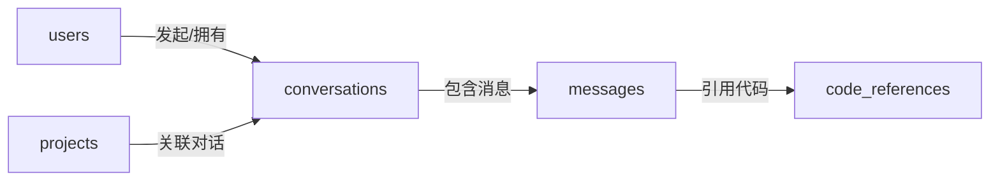

# 项目维基 (Project Wiki)

## 📋 目录

- [项目概述](#项目概述)
- [架构设计](#架构设计)
- [技术栈详解](#技术栈详解)
- [模块说明](#模块说明)
- [开发指南](#开发指南)
- [API接口文档](#api接口文档)
- [数据库设计](#数据库设计)
- [部署指南](#部署指南)
- [常见问题](#常见问题)

---

## 项目概述

### 项目名称
智能代码助手平台 (Code Assistant Platform)

### 项目定位
基于微服务架构的智能代码辅助工具，结合传统后端技术(Java)和AI技术(Python)，为开发者提供智能问答、代码审查、文档生成等功能。

### 核心价值
- 🎯 **技术全面性**: 同时展示Java后端和Python Agent开发能力
- 🏗️ **架构合理性**: 微服务架构，业务逻辑与AI推理分离
- 💼 **求职导向**: 专为Agent应用开发岗位设计的项目

### 项目目标
- 3-4个月完成MVP版本
- 包含完整的用户系统、项目管理、Agent服务
- 支持Docker一键部署
- 代码质量达到生产级别

> 版本一致性说明：当前实现采用 Spring Boot 2.7.18 + Java 17；OpenAPI 使用 Springdoc 1.7.x；Spring Security 采用 Boot 2.7 风格配置（EnableGlobalMethodSecurity + antMatchers）。

---

## 架构设计

### 1. 整体架构

```
┌─────────────────────────────────────────────────────────┐
│                     前端层                               │
│        React 18 + TypeScript + Tailwind CSS             │
│              Neo-Brutalism 设计风格                      │
└─────────────────────────────────────────────────────────┘
                            ↓
┌─────────────────────────────────────────────────────────┐
│                   Nginx 反向代理                         │
│              - 请求路由                                  │
│              - 负载均衡                                  │
│              - 静态资源服务                              │
└─────────────────────────────────────────────────────────┘
                            ↓
        ┌───────────────────┴───────────────────┐
        ↓                                       ↓
┌─────────────────────┐              ┌─────────────────────┐
│   Java 业务服务层    │              │  Python Agent层     │
│   (Spring Boot)     │   HTTP REST  │    (FastAPI)        │
│                     │ ←──────────→ │                     │
│ ┌─────────────────┐ │              │ ┌─────────────────┐ │
│ │  用户服务        │ │              │ │ 代码问答Agent   │ │
│ │  - 注册/登录     │ │              │ │ - RAG检索       │ │
│ │  - JWT认证      │ │              │ │ - 对话管理      │ │
│ │  - 权限管理     │ │              │ └─────────────────┘ │
│ └─────────────────┘ │              │                     │
│                     │              │ ┌─────────────────┐ │
│ ┌─────────────────┐ │              │ │ 代码审查Agent   │ │
│ │  项目服务        │ │              │ │ - 静态分析      │ │
│ │  - 项目CRUD     │ │              │ │ - LLM深度审查   │ │
│ │  - 代码仓库管理 │ │              │ │ - 报告生成      │ │
│ │  - 任务调度     │ │              │ └─────────────────┘ │
│ └─────────────────┘ │              │                     │
│                     │              │ ┌─────────────────┐ │
│ ┌─────────────────┐ │              │ │ 文档生成Agent   │ │
│ │  网关服务        │ │              │ │ - 代码解析      │ │
│ │  - 请求路由     │ │              │ │ - 文档模板      │ │
│ │  - 限流熔断     │ │              │ │ - Markdown生成  │ │
│ └─────────────────┘ │              │ └─────────────────┘ │
└─────────────────────┘              └─────────────────────┘
        ↓                                       ↓
┌─────────────────────────────────────────────────────────┐
│                      数据存储层                          │
│  ┌──────────────┐  ┌──────────────┐  ┌──────────────┐  │
│  │ PostgreSQL   │  │    Redis     │  │  ChromaDB    │  │
│  │ - 用户数据   │  │  - 缓存      │  │ - 向量存储   │  │
│  │ - 项目数据   │  │  - Session   │  │ - 代码索引   │  │
│  │ - 任务记录   │  │  - 消息队列  │  │              │  │
│  └──────────────┘  └──────────────┘  └──────────────┘  │
└─────────────────────────────────────────────────────────┘
```

### 2. 服务职责划分

#### Java服务层
**职责**: 处理业务逻辑、数据持久化、用户认证

| 服务名称 | 端口 | 职责 |
|---------|------|------|
| user-service | 8080 | 用户注册、登录、JWT认证、权限管理 |
| project-service | 8081 | 项目管理、仓库接入、任务调度 |
| gateway-service (可选) | 8888 | API网关、统一鉴权、限流 |

**技术栈**:
- Spring Boot 3.2
- Spring Security
- MyBatis-Plus
- JWT
- Redis

#### Python Agent层
**职责**: AI推理、代码分析、向量检索

| 模块名称 | 职责 |
|---------|------|
| QA Agent | 基于RAG的代码问答 |
| Review Agent | 代码质量审查 |
| Doc Agent | 自动文档生成 |
| Index Service | 代码向量化和索引 |

**技术栈**:
- FastAPI
- LangChain
- LlamaIndex
- ChromaDB
- Celery

### 3. 服务间通信

#### 通信方式
```
Java → Python: HTTP REST API
Python → Java: HTTP REST API (回调)
异步任务: Redis消息队列
```

#### 通信流程示例
```
用户请求代码审查:
1. 前端 → Nginx → Java project-service
2. Java创建审查任务,返回task_id
3. Java异步调用 Python review-agent API
4. Python执行审查,结果存入Redis
5. Java轮询或WebSocket推送结果给前端
```

---

## 技术栈详解

### 前端技术栈

#### React 18 + TypeScript
- **选择理由**: 生态最成熟，求职市场需求最大
- **核心特性**:
  - 函数式组件 + Hooks
  - 类型安全
  - 并发渲染特性

#### Tailwind CSS
- **选择理由**: 原子化 CSS，快速开发，易于实现 Neo-Brutalism 风格
- **核心特性**:
  - 无需写自定义 CSS
  - 直接在 JSX 中使用样式类
  - 构建时自动剔除未使用样式

#### Vite
- **选择理由**: 极速开发服务器，热更新快
- **核心特性**:
  - 原生 ES Module
  - 快速冷启动
  - 优化的构建产物

#### Neo-Brutalism 设计风格
- **风格特征**:
  - 黑色实线边框（1-3px）
  - 无模糊、位移型硬阴影（3/6/10px）
  - 黑白为底 + 1-2 个点缀纯色
  - 直角或极小圆角（2px）
  - 高对比度，拒绝柔和
- **详细规范**: 参见 `docs/FRONTEND_DESIGN_SPEC.md`

#### Zustand
- **选择理由**: 轻量级状态管理，比 Redux 简单
- **核心特性**:
  - 无样板代码
  - TypeScript 友好
  - 学习曲线平缓

### Java技术栈

#### Spring Boot 3.2
- **选择理由**: 最新稳定版,性能优化,原生支持GraalVM
- **核心特性**:
  - 自动配置
  - 嵌入式服务器
  - 生产级监控(Actuator)

#### Spring Security + JWT
- **认证流程**:
  ```
  1. 用户登录 → 验证用户名密码
  2. 生成JWT Token (Access + Refresh)
  3. 前端携带Token访问API
  4. JwtAuthenticationFilter验证Token
  5. 提取用户信息,注入SecurityContext
  ```

#### MyBatis-Plus
- **选择理由**: 比JPA更灵活,比MyBatis更简洁
- **核心功能**:
  - 单表CRUD无需写SQL
  - 分页插件
  - 逻辑删除
  - 乐观锁

#### Redis
- **用途**:
  1. 缓存热点数据 (用户信息、项目配置)
  2. Session存储
  3. 分布式锁
  4. 消息队列(可选)

### Python技术栈

#### FastAPI
- **选择理由**:
  - 性能接近Go/Node.js
  - 自动生成OpenAPI文档
  - 原生异步支持
  - 类型提示友好

#### LangChain
- **核心组件**:
  ```python
  - LLM: 大模型接口封装
  - Prompt Templates: 提示词模板
  - Chains: 工作流编排
  - Agents: 自主决策和工具调用
  - Memory: 对话历史管理
  - Retrievers: 向量检索
  ```

#### ChromaDB
- **选择理由**:
  - 轻量级,无需独立服务
  - Python原生支持
  - 适合MVP阶段
- **可替换方案**: Pinecone, Milvus, Weaviate

#### Celery
- **用途**: 异步任务处理
  - 代码索引任务
  - 批量审查任务
  - 定时任务

---

## 模块说明

### Java模块

#### 1. user-service (用户服务)

**目录结构**:
```
user-service/
├── controller/          # API控制器
│   ├── AuthController.java       # 认证接口
│   └── UserController.java       # 用户管理接口
├── service/            # 业务逻辑
│   ├── AuthService.java
│   ├── UserService.java
│   └── impl/
├── mapper/             # 数据访问
│   └── UserMapper.java
├── entity/             # 实体类
│   └── User.java
├── dto/                # 数据传输对象
│   ├── LoginRequest.java
│   ├── RegisterRequest.java
│   └── UserResponse.java
├── security/           # 安全相关
│   ├── JwtAuthenticationFilter.java
│   ├── JwtTokenProvider.java
│   └── SecurityConfig.java
└── config/             # 配置类
    ├── RedisConfig.java
    └── SwaggerConfig.java
```

**核心功能**:
- ✅ 用户注册 (密码加密)
- ✅ 用户登录 (JWT生成)
- ✅ Token刷新
- ✅ 用户信息CRUD
- ✅ 权限验证

#### 2. project-service (项目服务)

**目录结构**:
```
project-service/
├── controller/
│   ├── ProjectController.java
│   └── RepositoryController.java
├── service/
│   ├── ProjectService.java
│   ├── RepositoryService.java
│   └── AgentClientService.java  # 调用Python服务
├── entity/
│   ├── Project.java
│   └── Repository.java
└── dto/
    ├── ProjectCreateRequest.java
    └── CodeReviewRequest.java
```

**核心功能**:
- ✅ 项目CRUD
- ✅ GitHub仓库接入
- ✅ 调用Python Agent服务
- ✅ 任务状态管理

### Python模块

#### agent-service

**目录结构**:
```
agent-service/
├── app/
│   ├── main.py                 # FastAPI入口
│   ├── api/v1/
│   │   ├── chat.py            # 问答接口
│   │   ├── review.py          # 审查接口
│   │   └── index.py           # 索引接口
│   ├── agents/
│   │   ├── base_agent.py      # Agent基类
│   │   ├── qa_agent.py        # 问答Agent
│   │   ├── review_agent.py    # 审查Agent
│   │   └── doc_agent.py       # 文档Agent
│   ├── services/
│   │   ├── code_indexer.py    # 代码索引
│   │   ├── vectorstore.py     # 向量存储
│   │   └── llm_service.py     # LLM调用
│   ├── models/
│   │   ├── chat.py            # 对话模型
│   │   └── review.py          # 审查模型
│   └── core/
│       ├── config.py          # 配置
│       └── dependencies.py    # 依赖注入
└── tests/
```

**核心功能**:
- ✅ 代码问答 (RAG)
- ✅ 代码审查 (静态+LLM)
- ✅ 文档生成
- ✅ 代码向量化索引

---

## 开发指南

### 环境准备

#### 必需软件
```bash
# Java环境
JDK 17+
Maven 3.8+

# Python环境
Python 3.10+
pip

# 数据库和缓存
PostgreSQL 14+
Redis 7+

# 容器
Docker 20+
Docker-compose 2.0+
```

#### IDE推荐
- **Java**: IntelliJ IDEA (推荐) / Eclipse
- **Python**: PyCharm / VSCode

### 本地开发流程

#### 1. 启动基础服务
```bash
# 使用Docker启动数据库和Redis
docker-compose up -d postgres redis

# 检查服务状态
docker-compose ps
```

#### 2. 启动Java服务
```bash
cd java-service/user-service

# 安装依赖
mvn clean install

# 启动服务
mvn spring-boot:run

# 访问: http://localhost:8080/swagger-ui.html
```

#### 3. 启动Python服务
```bash
cd agent-service

# 创建虚拟环境
python -m venv venv
source venv/bin/activate  # Windows: venv\Scripts\activate

# 安装依赖
pip install -r requirements.txt

# 启动服务
uvicorn app.main:app --reload --port 8000

# 访问: http://localhost:8000/docs
```

### 开发规范

#### Git提交规范
```
<type>(<scope>): <subject>

type:
- feat: 新功能
- fix: 修复bug
- docs: 文档更新
- style: 代码格式
- refactor: 重构
- test: 测试
- chore: 构建/工具

示例:
feat(user): 添加用户注册接口
fix(auth): 修复JWT过期时间计算错误
docs(readme): 更新安装文档
```

#### 代码规范
**Java**:
- 遵循阿里巴巴Java开发手册
- 使用Lombok减少模板代码
- Controller只做参数校验和路由
- Service层包含业务逻辑

**Python**:
- 遵循PEP 8
- 使用类型提示
- 函数保持单一职责
- 及时添加文档字符串

#### 测试规范
- 单元测试覆盖率 > 70%
- 关键业务逻辑必须有测试
- API接口需要集成测试

---

## API接口文档

### Java API (端口8080)

#### 认证接口

**POST /api/v1/auth/register**
```json
// 请求
{
  "username": "testuser",
  "email": "test@example.com",
  "password": "Password123!"
}

// 响应
{
  "code": 200,
  "message": "注册成功",
  "data": {
    "userId": 1,
    "username": "testuser"
  }
}
```

**POST /api/v1/auth/login**
```json
// 请求
{
  "username": "testuser",
  "password": "Password123!"
}

// 响应
{
  "code": 200,
  "data": {
    "accessToken": "eyJhbGciOiJIUzI1NiIs...",
    "refreshToken": "eyJhbGciOiJIUzI1NiIs...",
    "expiresIn": 86400
  }
}
```

#### 项目管理接口

**POST /api/v1/projects**
```json
// 请求 (需要Authorization header)
{
  "name": "我的项目",
  "description": "项目描述",
  "repositoryUrl": "https://github.com/user/repo"
}

// 响应
{
  "code": 200,
  "data": {
    "projectId": 1,
    "name": "我的项目",
    "status": "INDEXING"
  }
}
```

#### 对话与消息接口（Chat API）

**POST /api/v1/chat/conversations**
```json
// 请求（需要 Authorization 头，用户从上下文获取）
{
  "projectId": 1,
  "title": "关于用户登录模块的讨论"
}

// 响应
{
  "code": 200,
  "data": {
    "id": "conv-123",
    "projectId": 1,
    "userId": 42,
    "title": "关于用户登录模块的讨论",
    "createdAt": "2025-11-16T12:00:00",
    "updatedAt": "2025-11-16T12:00:00"
  }
}
```

**GET /api/v1/chat/conversations/{projectId}**
```json
// 响应
{
  "code": 200,
  "data": [
    {
      "id": "conv-123",
      "projectId": 1,
      "userId": 42,
      "title": "关于用户登录模块的讨论",
      "createdAt": "2025-11-16T12:00:00",
      "updatedAt": "2025-11-16T12:00:00"
    }
  ]
}
```

**POST /api/v1/chat/{conversationId}/messages**
```json
// 请求
{
  "content": "请帮我看一下登录接口的安全性问题？"
}

// 响应
{
  "code": 200,
  "data": {
    "id": 1001,
    "conversationId": "conv-123",
    "role": "user",
    "content": "请帮我看一下登录接口的安全性问题？",
    "sources": null,
    "createdAt": "2025-11-16T12:01:00"
  }
}
```

**GET /api/v1/chat/{conversationId}/messages**
```json
// 响应
{
  "code": 200,
  "data": [
    {
      "id": 1001,
      "conversationId": "conv-123",
      "role": "user",
      "content": "请帮我看一下登录接口的安全性问题？",
      "sources": null,
      "createdAt": "2025-11-16T12:01:00"
    }
  ]
}
```

### Python API (端口8000)

#### 代码问答接口

**POST /api/v1/chat/ask**
```json
// 请求
{
  "projectId": 1,
  "question": "这个项目的认证逻辑是如何实现的？",
  "conversationId": "conv-123" // 可选
}

// 响应
{
  "answer": "该项目使用JWT进行认证...",
  "sources": [
    {
      "file": "UserController.java",
      "line": 45,
      "content": "..."
    }
  ],
  "conversationId": "conv-123"
}
```

#### 代码审查接口

**POST /api/v1/review/analyze**
```json
// 请求
{
  "projectId": 1,
  "files": ["src/main/java/User.java"], // 可选,不传则审查全部
  "level": "full" // quick/standard/full
}

// 响应
{
  "taskId": "task-456",
  "status": "processing",
  "estimatedTime": 120 // 秒
}
```

**GET /api/v1/review/result/{taskId}**
```json
// 响应
{
  "status": "completed",
  "result": {
    "overallScore": 85,
    "issues": [
      {
        "file": "User.java",
        "line": 23,
        "severity": "warning",
        "message": "建议添加空值检查",
        "suggestion": "if (user == null) throw new ..."
      }
    ]
  }
}
```

---

## 数据库设计

### 用户表 (users)
```sql
CREATE TABLE users (
    id BIGSERIAL PRIMARY KEY,
    username VARCHAR(50) UNIQUE NOT NULL,
    email VARCHAR(100) UNIQUE NOT NULL,
    password VARCHAR(255) NOT NULL,  -- BCrypt加密
    avatar_url VARCHAR(255),
    role VARCHAR(20) DEFAULT 'USER',  -- USER, ADMIN
    status VARCHAR(20) DEFAULT 'ACTIVE',  -- ACTIVE, BANNED
    created_at TIMESTAMP DEFAULT CURRENT_TIMESTAMP,
    updated_at TIMESTAMP DEFAULT CURRENT_TIMESTAMP,
    deleted SMALLINT DEFAULT 0  -- 逻辑删除
);

CREATE INDEX idx_users_username ON users(username);
CREATE INDEX idx_users_email ON users(email);
```

### 项目表 (projects)
```sql
CREATE TABLE projects (
    id BIGSERIAL PRIMARY KEY,
    user_id BIGINT NOT NULL REFERENCES users(id),
    name VARCHAR(100) NOT NULL,
    description TEXT,
    repository_url VARCHAR(255),
    repository_type VARCHAR(20),  -- GITHUB, GITLAB, LOCAL
    status VARCHAR(20) DEFAULT 'CREATED',  -- CREATED, INDEXING, READY, ERROR
    index_status VARCHAR(20),
    language VARCHAR(50),
    total_files INT DEFAULT 0,
    indexed_files INT DEFAULT 0,
    created_at TIMESTAMP DEFAULT CURRENT_TIMESTAMP,
    updated_at TIMESTAMP DEFAULT CURRENT_TIMESTAMP,
    deleted SMALLINT DEFAULT 0
);

CREATE INDEX idx_projects_user_id ON projects(user_id);
CREATE INDEX idx_projects_status ON projects(status);
```

### 对话记录表 (conversations)
```sql
CREATE TABLE conversations (
    id VARCHAR(50) PRIMARY KEY,
    project_id BIGINT REFERENCES projects(id),
    user_id BIGINT REFERENCES users(id),
    title VARCHAR(200),
    created_at TIMESTAMP DEFAULT CURRENT_TIMESTAMP,
    updated_at TIMESTAMP DEFAULT CURRENT_TIMESTAMP
);

CREATE TABLE messages (
    id BIGSERIAL PRIMARY KEY,
    conversation_id VARCHAR(50) REFERENCES conversations(id),
    role VARCHAR(20),  -- user, assistant
    content TEXT,
    sources JSONB,  -- 引用的代码来源
    created_at TIMESTAMP DEFAULT CURRENT_TIMESTAMP
);
```

### 审查任务表 (review_tasks)
```sql
CREATE TABLE review_tasks (
    id VARCHAR(50) PRIMARY KEY,
    project_id BIGINT REFERENCES projects(id),
    user_id BIGINT REFERENCES users(id),
    status VARCHAR(20),  -- PENDING, PROCESSING, COMPLETED, FAILED
    level VARCHAR(20),   -- QUICK, STANDARD, FULL
    result JSONB,
    error_message TEXT,
    started_at TIMESTAMP,
    completed_at TIMESTAMP,
    created_at TIMESTAMP DEFAULT CURRENT_TIMESTAMP
);
```

---

## 对话系统数据模型（实现版）

> 注意：本节描述的是当前代码和数据库实际使用的对话相关表结构，用于补充上文的示例设计。



- `conversations`：按项目和用户维度存储会话元数据，字段包括 `id`、`project_id`、`user_id`、`title`、`deleted`、`created_at`、`updated_at` 等。
- `messages`：存储具体对话消息，字段包括 `id`、`conversation_id`、`role`（`user/assistant`）、`content`、`sources`（JSONB）、`deleted`、`created_at`、`updated_at` 等。
- `code_references`：按消息记录代码引用，字段包括 `id`、`message_id`、`file_path`、`start_line`、`end_line`、`deleted`、`created_at`、`updated_at` 等。
- 所有表的 `updated_at` 字段通过通用触发器 `update_updated_at_column` 自动维护，`deleted` 字段统一作为逻辑删除标记。

## 部署指南

### Docker部署 (推荐)

#### 1. 构建镜像
```bash
# 构建Java服务镜像
cd java-service/user-service
docker build -t code-assistant/user-service:latest .

# 构建Python服务镜像
cd agent-service
docker build -t code-assistant/agent-service:latest .
```

#### 2. 启动服务
```bash
# 使用docker-compose
docker-compose up -d

# 查看日志
docker-compose logs -f

# 停止服务
docker-compose down
```

### 生产环境部署

#### 使用云服务 (阿里云/腾讯云)
```
1. RDS PostgreSQL - 数据库
2. Redis云数据库 - 缓存
3. ECS/容器服务 - 应用部署
4. OSS - 文件存储
5. SLB - 负载均衡
```

#### 环境变量配置
```bash
# 生产环境
ENVIRONMENT=production
JWT_SECRET=<strong-random-secret>
POSTGRES_PASSWORD=<secure-password>
OPENAI_API_KEY=<your-api-key>
```

---

## 常见问题

### Q1: Java服务无法连接PostgreSQL?
```
检查:
1. PostgreSQL是否启动: docker-compose ps
2. 端口是否正确: 默认5432
3. 数据库是否创建: code_assistant
4. 用户名密码是否匹配
```

### Q2: Python服务启动报错?
```
常见原因:
1. 虚拟环境未激活
2. 依赖未安装: pip install -r requirements.txt
3. OpenAI API Key未配置
4. ChromaDB路径权限问题
```

### Q3: 如何调试服务间调用?
```
1. 查看Java日志: logs/user-service.log
2. 查看Python日志: uvicorn控制台输出
3. 使用Postman测试单个服务
4. 检查网络连通性: curl http://localhost:8000/health
```

### Q4: 向量检索效果不好?
```
优化策略:
1. 调整chunk_size和overlap
2. 优化代码分割策略
3. 使用混合检索(Dense + Sparse)
4. 调整top_k参数
5. 尝试不同的embedding模型
```

---

## 附录

### 学习资源
- Spring Boot官方文档
- FastAPI官方教程
- LangChain文档
- 《微服务设计》
- 《Designing Data-Intensive Applications》

### 参考项目
- Quivr - RAG知识库
- gpt-engineer - AI代码生成
- langchain-ChatGLM - 中文RAG实践

---

**最后更新**: 2025-11-15
**维护者**: [Your Name]

---

附录：Chat API 补充（实现对齐）

- 已实现分页查询消息接口：

**GET /api/v1/chat/{conversationId}/messages/paged**
- Query: `pageNum`（默认1，从1开始），`pageSize`（默认50）
```json
// 响应
{
  "code": 200,
  "data": {
    "records": [
      {
        "id": 1001,
        "conversationId": "conv-123",
        "role": "user",
        "content": "请帮我看一下登录接口的安全性问题？",
        "sources": null,
        "createdAt": "2025-11-16T12:01:00"
      }
    ],
    "current": 1,
    "size": 50,
    "total": 1
  }
}
```
